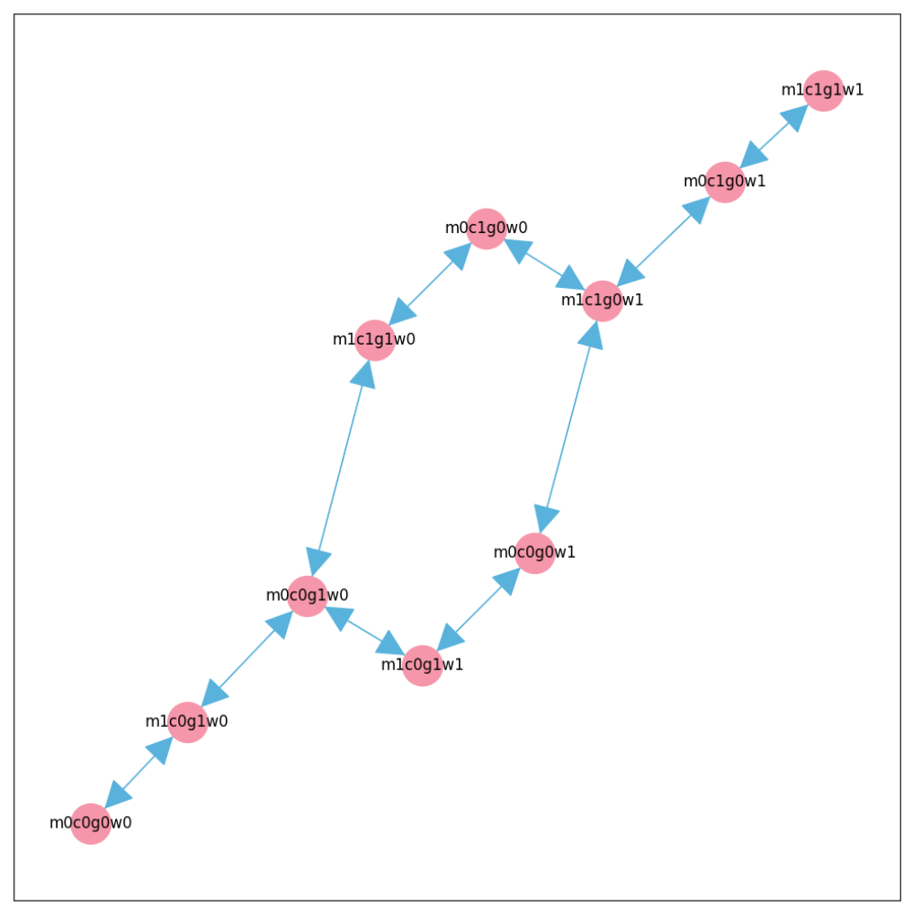

# ModelChecking
## 功能
使用Python实现的，面向对象风格的模型检测软件。  
直接运行.py文件运行样例，输出结果，并显示状态图。

## 样例解释
模型通过状态矩阵、状态限制、转移限制，和最终条件进行模型检测。  
所有river.json结尾的文件都是农夫过河问题的描述文件。  
其中:
m,c,g,w分别表示农夫、草、羊、狼；  
`connection_matrix`为状态转移矩阵，一般为全1即可，状态转移通过state和transition限制；  
`init`为状态初值，0表示在此岸，1表示在彼岸；  
`state_limit`为不能出现的状态，例如`{g == c and g != m}`表示羊g和草c在一侧，而羊g和农夫m不在一侧。
`transition_limit`为不能出现的转移方法，例如`{$CHANGES > 2}`表示不能同时有大于两个东西的状态发生改变，因为船一次只能乘2人。`{m.from == m.to}`表示农夫的转移前和转移后状态不能一致，必须移动。
